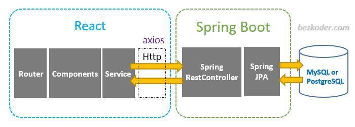
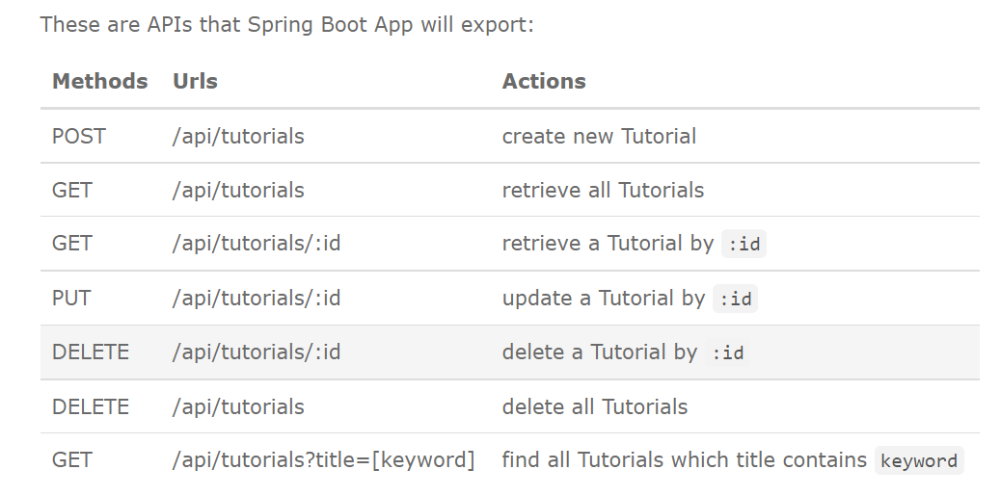
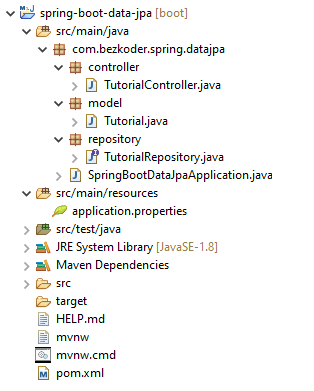

– Tutorial data model class corresponds to entity and table tutorials.

– TutorialRepository is an interface that extends JpaRepository for CRUD methods and custom finder methods. It will be autowired in TutorialController.

– TutorialController is a RestController which has request mapping methods for RESTful requests such as: getAllTutorials, createTutorial, updateTutorial, deleteTutorial, findByPublished…

– Configuration for Spring Datasource, JPA & Hibernate in application.properties.

– pom.xml contains dependencies for Spring Boot and MySQL/PostgreSQL.

The back-end server uses Spring Boot with Spring Web MVC for REST APIs and Spring Data JPA for interacting with MySQL/PostgreSQL database. Front-end side is made with React, React Router, Axios & Bootstrap.

spring-boot-react-crud-example-rest-api-architecture

– Spring Boot exports REST Apis using Spring Web MVC & interacts with Database using Spring JPA

– React Client sends HTTP Requests and retrieve HTTP Responses using axios, shows data on the components. We also use React Router for navigating to pages.

– Database could be MySQL or PostgreSQL.

– We make CRUD operations & finder methods with Spring Data JPA’s JpaRepository.

– The database could be MySQL or PostgreSQL depending on the way we configure project dependency & datasource.

Technology
Java 8
Spring Boot 2 (with Spring Web MVC, Spring Data JPA)
PostgreSQL/MySQL
Maven 3.6.1

– Tutorial data model class corresponds to entity and table tutorials.

– TutorialRepository is an interface that extends JpaRepository for CRUD methods and custom finder methods. It will be autowired in TutorialController.

– TutorialController is a RestController which has request mapping methods for RESTful requests such as: getAllTutorials, createTutorial, updateTutorial, deleteTutorial, findByPublished…

– Configuration for Spring Datasource, JPA & Hibernate in application.properties.

– pom.xml contains dependencies for Spring Boot and MySQL/PostgreSQL.

spring.datasource.username & spring.datasource.password properties are the same as your database installation.

Spring Boot uses Hibernate for JPA implementation, we configure MySQL5InnoDBDialect for MySQL

spring.jpa.hibernate.ddl-auto is used for database initialization. We set the value to update value so that a table will be created in the database automatically corresponding to defined data model. Any change to the model will also trigger an update to the table. For production, this property should be validate.
